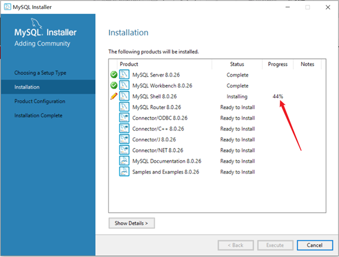
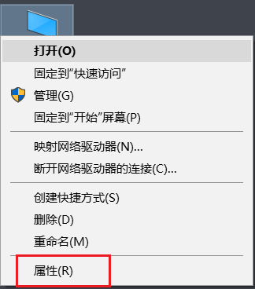

# MySQL安装文档-Windows

## MySQL安装

### 1. 安装

**1). 双击官方下来的安装包文件**

 

**2). 根据安装提示进行安装**

 

 

 

安装MySQL的相关组件，这个过程可能需要耗时几分钟，耐心等待。

 

 

 

 

==输入MySQL中root用户的密码,一定记得记住该密码==

 

 

 

### 2. 配置

安装好MySQL之后，还需要配置环境变量，这样才可以在任何目录下连接MySQL。

1). 在此电脑上，右键选择属性

 

2). 点击左侧的 "高级系统设置"，选择环境变量

 

3). 找到 Path 系统变量, 点击 "编辑"

 

4). 选择 "新建" , 将MySQL Server的安装目录下的bin目录添加到环境变量

 

